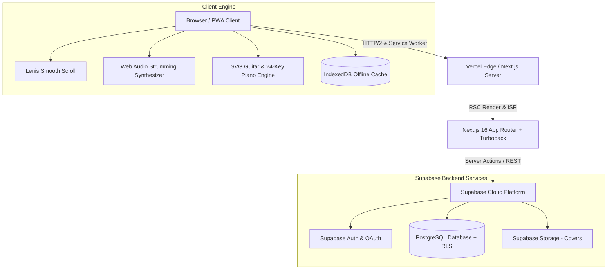
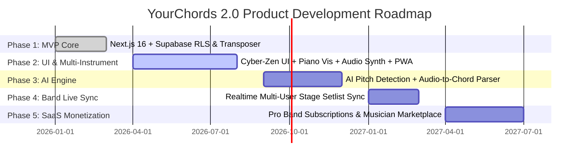

# PRD.md — Product Requirement Document
> **Role Context**: Chief Product Officer (CPO) Product Specification & System Blueprint  
> **Project**: YourChords 2.0 — International-Grade SaaS Music Chord & Lyrics Platform  
> **Status**: Official Engineering & Product Baseline (v2.0.0)  
> **Target Aesthetic**: Cyber-Zen Premium Dark Mode (`#070a12` Obsidian Canvas)

---

## 1. Executive Summary & Visi Produk

### 1.1 Visi & Misi Produk
**YourChords 2.0** didesain sebagai platform pencarian, pembelajaran, dan performa lirik & chord lagu kelas dunia bertaraf **SaaS Internasional**. Platform ini menjembatani kebutuhan musisi amatir hingga profesional (gitaris, pianis, vokalis, dan band leader) dengan menyajikan antarmuka super-responsif, visualisasi instrumen interaktif, serta kemampuan eksekusi offline (*PWA Native*).

Visi produk ini diwujudkan melalui filosofi desain **Cyber-Zen Premium Dark Mode**, sebuah standar UI/UX bebas *"AI Slop"* yang menggabungkan estetika obsidian futuristik dengan fungsionalitas monospaced presisi tinggi untuk musik numerik dan akord.

```
+-------------------------------------------------------------------------------+
|                             YOURCHORDS 2.0 VISION                             |
+-------------------------------------------------------------------------------+
|  [Musician-Centric UI]   -->   [Real-Time Audio & Transpose Engine]          |
|  [Multi-Instrument SVG]  -->   [Edge ISR <50ms & PWA Offline Capability]      |
|  [User Workspace & CMS]  -->   [Enterprise Supabase RLS & Auth Layer]         |
+-------------------------------------------------------------------------------+
```

### 1.2 Problem Statement vs Product Solution

| Masalah Platform Chord Traditional (Legacy) | Solusi Superior YourChords 2.0 |
| :--- | :--- |
| **Iklan Memenuhi Layar & UI Lambat**: Loading lama dengan layout berantakan. | **Sub-50ms ISR Performance**: Server Components (RSC) dengan Next.js 16 & Turbopack tanpa hambatan iklan. |
| **Disproporsi Chord & Lirik**: Teks chord bergeser saat layar di-resize. | **JetBrains Mono Engine**: Presisi fixed-width character alignment menjamin posisi chord 100% akurat di atas suku kata. |
| **Terbatas pada Gitar Saja**: Tidak ada visualisasi untuk instrumen keyboard/piano. | **Dual-Instrument Visualizer**: SVG Barre Chord Fretboard & 24-Key Interactive Piano Visualizer instan. |
| **Gagal Saat Offline di Panggung**: Koneksi drop mematikan tampilan lirik. | **PWA & IndexedDB Engine**: `YourChordsOfflineDB` menyimpan chord favorit langsung ke storage lokal browser. |
| **Fitur Transpose Kaku**: Menyebabkan akord kompleks pecah atau salah nada. | **Smart Transposer Engine**: Algoritma modulasi semitone (-12 s/d +12), penyederhana *Simplifier*, dan kalkulator Capo rasional. |

### 1.3 Key Value Proposition & Target User Personas
1. **The Live Performer (Guitarist/Keyboardist)**: Membutuhkan *Auto-Scroll Teleprompter* bebas genggam dengan kontrol kecepatan dinamis dan mode tampilan *Stage Mode* penuh.
2. **The Beginner Musician**: Membutuhkan fitur *Chord Simplifier* untuk mengubah chord kompleks (misal: `F#m7b5` atau `Cmaj7`) menjadi chord dasar major/minor serta visualizer diagram SVG interaktif.
3. **The Band Leader / Content Creator**: Membutuhkan fitur *Setlist / Songbook Builder* untuk menyusun daftar lagu konser dan kemampuan *Personal Notes* untuk mencatat pola *strumming* atau kunci capo per lagu.
4. **Platform Admin & Moderator**: Membutuhkan *Command Center CMS* untuk mengedit konten global dan *Typo Moderation Panel* untuk menyetujui usulan perbaikan chord secara *real-time*.

### 1.4 Core Metric KPIs

> [!NOTE]
> Seluruh indikator kinerja produk dievaluasi secara berkala melalui pengujian otomatis dan analytics.

* **Core Web Vitals**: Lighthouse Score ≥ **95** di seluruh kategori (Performance, Accessibility, Best Practices, SEO).
* **Page Load Latency**: Target **< 50ms** untuk halaman ter-cache via ISR (*Incremental Static Regeneration*).
* **Transposition Latency**: Real-time Client Transposition **< 5ms** tanpa *re-render* layout.
* **Offline Storage Speed**: Pembacaan dari IndexedDB `YourChordsOfflineDB` **< 15ms**.
* **Moderation Throughput**: Waktu persetujuan *Typo Moderation Panel* kurang dari 3 klik per entri lagu.

---

## 2. Tech Stack Architecture & System Topology

### 2.1 Technology Stack Definition



* **Core Framework**: `Next.js 16` (App Router, Server Components RSC secara *default*, Server Actions untuk mutasi, Turbopack compiler).
* **Language & Strictness**: `TypeScript 5.8+` (*Strict Mode* aktif, larangan mutlak penggunaan `any`, runtime type validation via Zod).
* **Styling & Design Tokens**: `Tailwind CSS v4` + **Cyber-Zen Token System** (`#070a12` Obsidian Canvas, `#06b6d4` Cyan Neon, `#a855f7` Purple Neon, Glassmorphism `backdrop-blur-md`).
* **UI Components & Icons**: `21st.dev` primitives, `@radix-ui/react-label`, `Lucide React` icons, `@tabler/icons-react`.
* **Animations & Micro-interactions**: `Framer Motion v12`, `GSAP 3.13`, `Simplex Noise`, `Lenis Smooth Scroll`.
* **Database & Auth**: `Supabase` (PostgreSQL, Row-Level Security RLS, JWT Authentication, Supabase Auth Context).
* **Parsing & Audio Engine**: `ChordSheetJS` parser, Web Audio API Custom Strumming & Piano Synthesizer, custom Regex Transposer & Simplifier.
* **Offline Engine**: Browser `IndexedDB` (`YourChordsOfflineDB`) & Service Worker (`sw.js`) PWA installation prompt.

---

## 3. Core Product Features (Detailed Functionality)

### 3.1 Interactive Chord Sheet & Smart Transposer Engine

```
[ Original Key: G ] ---> ( Transpose: +2 ) ---> [ Transposed Key: A ]
[ Simplifier: OFF ]  ---> ( Capo: Fret 2 ) ---> [ Capo Adjusted Shapes ]
```

* **JetBrains Mono Alignment**: Lirik dan chord dirender menggunakan font monospaced `JetBrains Mono` yang menjamin jarak spasial tetap presisi saat ukuran font diubah.
* **Smart Transposer Algorithmic Core**:
  * Menggunakan ekspresi reguler presisi tinggi:  
    `/(?<![a-zA-Z0-9_#])([A-G][#b]?(?:m|maj|min|dim|aug|sus|add|7|9|11|13|b5|#5|b9|#9)*(?:\/[A-G][#b]?)?)(?![a-zA-Z0-9_#])/g`
  * Mendukung pergeseran modulasi semitone (-12 hingga +12).
  * Menangani *slash chords* (misal: `C/E` -> `D/F#` jika ditranspose +2).
  * Deteksi enharmonisasi cerdas (Format Sharp `#` vs Flat `b`).
* **Chord Simplifier Engine**:
  * Fitur 1-klik untuk menyederhanakan akord tingkat lanjut bagi pemula:
    * `Cmaj7`, `C7`, `Cadd9`, `Csus4` -> `C`
    * `Am7`, `Am9`, `Asus2` -> `Am`
    * `F#m7b5` -> `F#m`
    * Penghapusan not bass *slash chord* (`A/C#` -> `A`).
* **Capo Transposition Calculator**: Mengkalkulasi otomatis posisi bentuk jari gitar jika capo dipasang pada Fret X (misal: Capo Fret 2 pada lagu Kunci Dasar A akan menampilkan bentuk chord G).

### 3.2 Dual-Instrument Visualizer System (Guitar & Piano)

> [!TIP]
> Musisi dapat dengan mudah mengalihkan tab visualizer antara **SVG Guitar Barre Chords** dan **24-Key Interactive Piano**.

```
GUITAR VISUALIZER (SVG Barre Chord)       PIANO VISUALIZER (24-Key Keyboard)
+-----------------------------------+     +-----------------------------------+
| Fret 1  [=== Barre (Fret 1) ===]  |     |  || | | ||| | | || | | ||| | | || |
| Fret 2       (2) Middle           |     |  ||C|D| ||F|G|A| ||C|D| ||F|G|A| ||
| Fret 3    (3) Ring  (4) Pinky     |     |  | |_| |_| | |_| |_| |_| | |_| |_| |_| |
+-----------------------------------+     +-----------------------------------+
```

#### A. SVG Guitar Barre Chord Engine
* **Multilayer SVG Renderer**: Merender 6 senar gitar (Low E ke High E), fretlines, nut indicator, dan penomoran fret awal (*baseFret*).
* **Barre Chord Detection**: Deteksi otomatis akord palang (misal: `F`, `Bm`, `C#m`) dengan indikator garis horizontal dan nomor jari (*Index finger = 1*).
* **Multi-Tier Fallback Parser**:
  1. *Exact match* pada Kamus Chord (`CHORD_DICTIONARY`).
  2. *Slash Chord Parser* (`C/E` -> coba `C/E` lalu fallback ke `C`).
  3. *Suffix Stripping* (`Am9` -> fallback ke `Am`).
  4. *Default Safe Fallback* (Menampilkan chord `C` dengan label chord target agar antarmuka tidak rusak).

#### B. 24-Key Interactive Piano Visualizer
* **2-Octave Keyboard Canvas**: Merender 24 tuts piano (tuts putih & tuts hitam) dengan pencahayaan not aktif.
* **Note Calculator Engine**: Mengalkulasi not pembentuk akord (Root, 3rd, 5th, 7th) dan menyalakan tuts piano terkait dengan efek neon Cyan (`#06b6d4`).

### 3.3 Auto-Scroll Teleprompter & Web Audio Synthesizer

* **Auto-Scroll Teleprompter Engine**:
  * Kontrol kecepatan dinamis dari 1x hingga 10x (dikalkulasi via `requestAnimationFrame` linier).
  * Tombol pintas keyboard (*Spacebar* untuk Play/Pause, *Panah Atas/Bawah* untuk Kontrol Kecepatan).
  * Jeda Otomatis (*Pause-on-Hover/Touch*) saat musisi menyentuh atau mengarahkan kursor ke area chord sheet.
  * Tampilan *Stage Mode* layar penuh (*Full-Screen Clean View*).
* **Web Audio Strumming Synthesizer**:
  * Synthesizer internal berbasis Web Audio API tanpa *sample file* besar.
  * Menghasilkan suara *strumming acoustic guitar* dan *piano chord voicing* secara sintetis saat tombol *"Play Chord"* dipencet.
  * **Metronome Engine**: Audio click track dengan tempo BPM yang dapat disesuaikan (40 - 240 BPM).

### 3.4 Dynamic Bento Grid Homepage & Multi-Filter Catalog

* **Cyber-Zen Bento Grid Layout**:
  * **Hero Carousel Banner**: Menampilkan lagu-lagu populer utama dengan *glassmorphism backdrop*.
  * **Trending Songs Grid**: Kartu lagu terpopuler yang dilengkapi indikator jumlah tayangan (*view_count*).
  * **New Releases & Featured Artists**: Informasi album dan artis terkurasi.
  * **Quick Tools Widget**: Akses cepat ke Transposer, Metronom, dan Fretboard visualizer.
* **Multi-Filter Catalog & Instant Search**:
  * Pencarian instant client-side didukung pencocokan *fuzzy* `Fuse.js`.
  * Filter berdasarkan **Genre** (Pop, Rock, Jazz, Dangdut, Indie, Acoustic), **Difficulty** (Beginner, Intermediate, Advanced), dan **Key Signature**.
  * Urutan pencarian (*Sort By*): Terpopuler (*Views*), Terbaru (*Created At*), dan Abjad (*A-Z*).
* **Search Fallback & Missing Song Logging Engine**:
  * Apabila kata kunci lagu tidak ditemukan di database, sistem secara otomatis mencatat *query* tersebut ke tabel Supabase `missing_songs_log` / `search_logs`.
  * Halaman *Missing Songs Panel* pada admin menampilkan daftar lagu yang paling banyak dicari pengguna namun belum tersedia untuk ditindaklanjuti.

### 3.5 User Workspace & Admin Command Center

```
+-------------------------------------------------------------------------------+
|                             YOURCHORDS 2.0 WORKSPACE                          |
+-------------------------------------------------------------------------------+
|  USER WORKSPACE:                                                              |
|  - Favorites Collection (Synced with Supabase 'song_favorites')               |
|  - Personal Setlists / Songbooks (Custom folder, song reordering)             |
|  - Personal Song Notes (Custom strumming patterns, capo notes)                |
|                                                                               |
|  ADMIN COMMAND CENTER:                                                        |
|  - CMS Global Editor (Update Hero title, announcements, site slogan)          |
|  - Typo Moderation Panel (Review pending 'song_corrections', approve/reject)  |
|  - Batch Scraper & Catalog Manager (Scrape & validate chord contents)         |
+-------------------------------------------------------------------------------+
```

---

## 4. Database Schema & Data Model Documentation

Semua entitas database dikelola melalui Supabase PostgreSQL dengan dukungan **Row-Level Security (RLS)** untuk menjamin keamanan akses data.

### 4.1 Schema Definitions & Data Types

#### 1. Tabel `songs` (Katalog Lagu Utama)
```sql
CREATE TABLE public.songs (
  id VARCHAR PRIMARY KEY, -- Slug unik (misal: 'dewa-19-kangen')
  title VARCHAR NOT NULL,
  artist VARCHAR NOT NULL,
  chords TEXT NOT NULL, -- Konten lirik dan chord (JetBrains Mono format)
  content TEXT,
  view_count INT DEFAULT 0,
  difficulty VARCHAR(20) CHECK (difficulty IN ('Beginner', 'Intermediate', 'Advanced')),
  genre VARCHAR(50),
  key_chord VARCHAR(10),
  spotify_track_id VARCHAR(100),
  youtube_video_id VARCHAR(100),
  album_id UUID REFERENCES public.albums(id) ON DELETE SET NULL,
  created_at TIMESTAMPTZ DEFAULT NOW(),
  updated_at TIMESTAMPTZ DEFAULT NOW()
);
```

#### 2. Tabel `albums` (Koleksi Album & Cover)
```sql
CREATE TABLE public.albums (
  id UUID PRIMARY KEY DEFAULT gen_random_uuid(),
  title VARCHAR NOT NULL,
  artist VARCHAR NOT NULL,
  cover_url TEXT NOT NULL,
  release_year INT,
  created_at TIMESTAMPTZ DEFAULT NOW()
);
```

#### 3. Tabel `user_favorites` / `song_favorites` (Lagu Favorit Pengguna)
```sql
CREATE TABLE public.user_favorites (
  id UUID PRIMARY KEY DEFAULT gen_random_uuid(),
  user_id UUID NOT NULL REFERENCES auth.users(id) ON DELETE CASCADE,
  song_id VARCHAR NOT NULL REFERENCES public.songs(id) ON DELETE CASCADE,
  created_at TIMESTAMPTZ DEFAULT NOW(),
  UNIQUE(user_id, song_id)
);
```

#### 4. Tabel `setlists` / `user_setlists` (Daftar Setlist & Songbook)
```sql
CREATE TABLE public.setlists (
  id UUID PRIMARY KEY DEFAULT gen_random_uuid(),
  user_id UUID NOT NULL REFERENCES auth.users(id) ON DELETE CASCADE,
  name VARCHAR(100) NOT NULL,
  description TEXT,
  song_ids JSONB DEFAULT '[]'::jsonb, -- Array string ID lagu
  created_at TIMESTAMPTZ DEFAULT NOW(),
  updated_at TIMESTAMPTZ DEFAULT NOW()
);
```

#### 5. Tabel `song_corrections` (Moderation Typo & Perbaikan Chord)
```sql
CREATE TABLE public.song_corrections (
  id UUID PRIMARY KEY DEFAULT gen_random_uuid(),
  song_id VARCHAR NOT NULL REFERENCES public.songs(id) ON DELETE CASCADE,
  user_id UUID REFERENCES auth.users(id) ON DELETE SET NULL,
  reason TEXT NOT NULL,
  proposed_content TEXT NOT NULL,
  original_content TEXT,
  status VARCHAR(20) DEFAULT 'pending' CHECK (status IN ('pending', 'approved', 'rejected')),
  created_at TIMESTAMPTZ DEFAULT NOW()
);
```

#### 6. Tabel `page_content` / `site_cms` (Pengaturan CMS Global)
```sql
CREATE TABLE public.page_content (
  id VARCHAR PRIMARY KEY, -- Misal: 'global_settings', 'hero_carousel'
  content JSONB NOT NULL,
  updated_at TIMESTAMPTZ DEFAULT NOW()
);
```

#### 7. Tabel `profiles` (Data Pengguna & Peran)
```sql
CREATE TABLE public.profiles (
  id UUID PRIMARY KEY REFERENCES auth.users(id) ON DELETE CASCADE,
  full_name TEXT,
  avatar_url TEXT,
  role VARCHAR(20) DEFAULT 'user' CHECK (role IN ('user', 'admin', 'super_admin')),
  created_at TIMESTAMPTZ DEFAULT NOW()
);
```

### 4.2 Entity-Relationship (ER) Diagram

```mermaid
erdiagram
    PROFILES ||--o{ USER_FAVORITES : "has favorites"
    PROFILES ||--o{ SETLISTS : "creates setlists"
    PROFILES ||--o{ SONG_CORRECTIONS : "submits corrections"
    ALBUMS ||--o{ SONGS : "contains"
    SONGS ||--o{ USER_FAVORITES : "favorited in"
    SONGS ||--o{ SONG_CORRECTIONS : "receives corrections"
    
    PROFILES {
        uuid id PK
        string full_name
        string avatar_url
        string role
    }
    SONGS {
        string id PK
        string title
        string artist
        text chords
        int view_count
        string difficulty
        uuid album_id FK
    }
    ALBUMS {
        uuid id PK
        string title
        string cover_url
    }
    USER_FAVORITES {
        uuid id PK
        uuid user_id FK
        string song_id FK
    }
    SETLISTS {
        uuid id PK
        uuid user_id FK
        string name
        jsonb song_ids
    }
    SONG_CORRECTIONS {
        uuid id PK
        string song_id FK
        uuid user_id FK
        string status
        text proposed_content
    }
```

---

## 5. Non-Functional Requirements (NFR)

### 5.1 Performance & Rendering Standards (ISR < 50ms)
* **Incremental Static Regeneration (ISR)**: Halaman detail lagu dikonfigurasi dengan `revalidate = 86400` (24 jam) dan di-revalidate secara dinamis melalui `revalidateTag('chords')` ketika ada pembaharuan dari admin.
* **Server Components Isolation**: Menjaga halaman tetap dirender di server (RSC) dan mengisolasi instruksi `'use client'` hanya pada komponen daun terkecil (*leaf components*) seperti tombol Transpose, Visualizer Modal, dan Auto-scroll controller.
* **Sub-50ms Edge Response**: Halaman ter-cache melayani request dari Vercel Edge Cache dengan *Time to First Byte (TTFB)* kurang dari 50ms.

### 5.2 Security & Git Exposure Guard
* **Supabase Row-Level Security (RLS)**:
  * Pembacaan tabel `songs`, `albums`, dan `page_content` terbuka untuk umum (*Public Read*).
  * Tabel `setlists`, `user_favorites`, dan `user_song_notes` strictly terisolasi per pengikut autentikasi (`auth.uid() = user_id`).
  * Mutasi pada tabel `page_content` dan peninjauan `song_corrections` secara eksklusif dibatasi untuk peran `admin` dan `super_admin`.
* **Git Exposure Guard**: Lingkungan pengembangan terlindungi oleh aturan eliminasi `.env.local` dari *version control*, dan penggunaan kunci Supabase Publik (*Anon Key*) yang terverifikasi aman.
* **XSS & Injection Protection**: Semua input usulan perbaikan chord dan catatan pribadi disanitasi sebelum dimasukkan ke dalam DOM.

### 5.3 PWA Offline Capability & IndexedDB Storage Engine
* **IndexedDB Architecture (`YourChordsOfflineDB`)**:
  * Menyimpan lagu-lagu favorit dan lagu yang dibuka pengguna ke object store `cached_songs`.
  * Memungkinkan musisi membuka dan memainkan chord sheet di atas panggung tanpa koneksi internet sama sekali.
* **Service Worker Caching (`sw.js`)**:
  * Strategi *Stale-While-Revalidate* untuk aset statis (font JetBrains Mono, ikon, CSS).
  * Prompt PWA Install interaktif (`PWAInstallPrompt.tsx`) yang terintegrasi dengan event `beforeinstallprompt` browser.

### 5.4 Aksesibilitas WCAG 2.1 AA Compliance
* **Contrast Ratio Guarantee**: Rasio kontras teks utama (`#f8fafc`) di atas latar obsidian (`#070a12`) memenuhi standar minimum **7:1** (melebihi standar AA 4.5:1). Teks aksen Cyan Neon (`#06b6d4`) dan Purple Neon (`#a855f7`) dirancang khusus agar mudah dibaca pada kegelapan panggung.
* **Keyboard Navigation & ARIA**:
  * Seluruh kontrol interaktif (modal Fretboard, tombol Transpose, slider Auto-scroll) memiliki elemen fokus visual yang jelas.
  * Tagging ARIA lengkap pada elemen kontrol audio synthetizer dan modal dialog.

---

## 6. Future Product Roadmap (Phased Strategy)



### Phase 1: MVP & Core SaaS Infrastructure [SELESAI]
* Migrasi ke Next.js 16 (App Router + Turbopack).
* Integrasi Supabase Auth & Database Schema dasar.
* Peluncuran Smart Transposer Engine & Monospaced Chord Sheet.
* Pengaturan awal keamanan RLS dan Git Guard.

### Phase 2: Cyber-Zen UI Overhaul & Multi-Instrument Expansion [BERJALAN / SELESAI]
* Implementasi sistem desain Cyber-Zen Premium Dark Mode.
* Peluncuran **Dual-Instrument Visualizer** (SVG Guitar Barre Chord & 24-Key Piano).
* Peluncuran **Web Audio Strumming Synthesizer** & Metronom.
* Integrasi **PWA Offline Mode** didukung IndexedDB `YourChordsOfflineDB`.
* Modul Admin Command Center (CMS Editor & Typo Moderation Panel).

### Phase 3: AI-Powered Chord Generation & Pitch Detection [Q4 2026]
* **Microphone Real-Time Pitch Detection**: Fitur pendeteksi nada gitar/piano via mikrofon perangkat menggunakan Web Audio API + Pitchy library.
* **AI Auto-Chord Parser**: Integrasi Google Gemini API / OpenAI untuk mengonversi berkas audio/video YouTube secara otomatis menjadi format lirik & chord *JetBrains Mono*.

### Phase 4: Collaborative Band Mode & Real-Time Sync [Q1 2027]
* **Live Stage Sync via Supabase Realtime**: Memungkinkan pemimpin band (*band leader*) mengontrol perpindahan halaman chord, kunci transpose, dan kecepatan auto-scroll secara *real-time* di seluruh perangkat anggota band di panggung.
* **Band Setlist Collaboration**: Mengedit dan menyusun setlist secara berkolaborasi dengan peran akses (*Owner*, *Editor*, *Viewer*).

### Phase 5: SaaS Monetization & Musician Marketplace [Q2 2027]
* **YourChords PRO Subscription**: Fitur berbayar untuk akses penyimpanan offline tanpa batas, pengubah kunci audio MP3/YouTube, dan ekspor PDF sheet music beresolusi tinggi.
* **Verified Creator Marketplace**: Musisi terverifikasi dapat mempublikasikan aransemen chord dan tabulasi gitar orisinal mereka untuk mendapatkan *royalty share*.

---

## 7. Strategy Monitoring, Logging, & Risk Mitigation

### 7.1 Analytics & Telemetry Strategy
* **Vercel Analytics & Speed Insights**: Memantau skor real-time Core Web Vitals (LCP, CLS, INP) di tingkat pengguna global.
* **Search Analytics Logging**: Merekam kueri pencarian lagu yang tidak ditemukan ke `missing_songs_log` untuk memprioritaskan pembuatan konten katalog baru.

### 7.2 Risk Analysis & Mitigation Matrix

| Potensi Risiko / Risk Event | Tingkat Dampak | Strategi Mitigasi (Preventive Action) |
| :--- | :--- | :--- |
| **Koneksi Supabase Terputus Saat Manggung** | Tinggi | Fallback otomatis membaca dari IndexedDB lokal `YourChordsOfflineDB` secara transparan. |
| **Pergeseran Tata Letak Chord Saat Transpose** | Sedang | Penggunaan aturan `font-mono` JetBrains Mono dan isolasi karakter per kata via CSS flex/grid. |
| **Penyalahgunaan Fitur Usulan Perbaikan (Spam Moderation)** | Sedang | Pembatasan kuota (*Rate limiting*) submit perbaikan dan validasi autentikasi pengguna. |
| **Regresi Tipe TypeScript pada Build CI/CD** | Tinggi | Eksekusi wajib `npm run type-check` (`npx tsc --noEmit`) dan `npm run lint` sebelum commit/deploy. |

---

> **Diproduksi oleh**: Chief Product Officer (CPO) & Lead System Architect  
> **Disetujui oleh**: Engineering Team & UI/UX Guild — YourChords 2.0  
> **Dokumen Resmi Repositori Proyek**: `PRD.md` (Root Directory)
